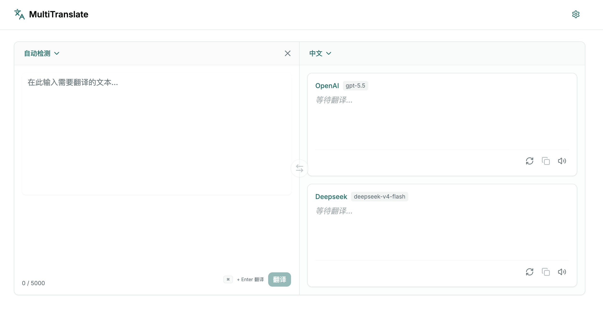

# Multi Translate

> A lightweight translation workbench built with React, TypeScript, and OpenAI-compatible APIs.

Multi Translate lets you configure multiple OpenAI-compatible model providers and compare their streaming translation results in one interface. It is designed for quick text translation, model output comparison, and building a simple browser-based translation workflow.

## Screenshot



## Features

- Multi-provider management: add, enable, and disable OpenAI-compatible API providers.
- Parallel streaming translation: send requests to all enabled providers and view results as they stream in.
- Provider connection checks: validate API Base URLs, API keys, and available models through the `/models` endpoint.
- Language detection: automatically detect the source language and adjust the target language intelligently.
- Language swap: switch source and target languages with one action.
- Custom prompt templates: configure translation prompts with `{sourceText}`, `{sourceLanguage}`, and `{targetLanguage}` variables.
- Local persistence: store provider and general settings in browser `localStorage`.
- Modern UI: built with Tailwind CSS, shadcn/ui, and Radix UI, with theme support.

## Tech Stack

- [React 19](https://react.dev/) - UI framework
- [TypeScript](https://www.typescriptlang.org/) - type safety
- [Vite](https://vite.dev/) - frontend build tool
- [Tailwind CSS 4](https://tailwindcss.com/) - styling
- [shadcn/ui](https://ui.shadcn.com/) / [Radix UI](https://www.radix-ui.com/) - UI components
- [OpenAI SDK](https://github.com/openai/openai-node) - OpenAI-compatible API requests
- [Sonner](https://sonner.emilkowal.ski/) - toast notifications

## Quick Start

### Requirements

- Node.js 20.19+ or 22.12+
- pnpm 9+ recommended

### Install dependencies

```bash
pnpm install
```

### Start the development server

```bash
pnpm dev
```

Then open the local URL shown in your terminal, usually:

```text
http://localhost:5173
```

### Build for production

```bash
pnpm build
```

### Preview the production build

```bash
pnpm preview
```

## Usage

### 1. Configure translation providers

Open the settings page and add or edit a provider:

| Field | Description | Example |
| --- | --- | --- |
| Provider Name | Display name used in the UI | `OpenAI Primary` |
| API Base URL | OpenAI-compatible API endpoint | `https://api.openai.com/v1` |
| API Key | Provider API key | `sk-...` |
| Models | Available model list | `gpt-4o-mini`, `gpt-4.1` |

Before saving, you can test the connection. The app sends a request to:

```text
GET {API_BASE_URL}/models
```

### 2. Customize the translation prompt

In general settings, you can edit the prompt template. The following variables are supported:

| Variable | Description |
| --- | --- |
| `{sourceText}` | Source text |
| `{sourceLanguage}` | Source language name |
| `{targetLanguage}` | Target language name |

The default template asks the model to return only the translated text without extra explanation.

### 3. Translate text

1. Enter the text you want to translate on the home page.
2. Select or automatically detect the source language.
3. Select the target language.
4. Start translation to receive parallel results from all enabled providers.

## Available Scripts

| Command | Description |
| --- | --- |
| `pnpm dev` | Start the development server |
| `pnpm build` | Run the TypeScript build and generate production assets |
| `pnpm preview` | Preview the production build locally |
| `pnpm lint` | Run ESLint checks |
| `pnpm typecheck` | Run TypeScript type checking |
| `pnpm format` | Format source files with Prettier |

## Privacy and Security

- API keys are currently stored in browser `localStorage`. Avoid using the app on untrusted or shared devices.
- Translation requests are sent directly from the browser to the configured API Base URL. For public deployments, consider adding a backend proxy, authentication, and server-side secret management.
- Language detection may call a third-party language detection service. Avoid entering sensitive content that should not be sent to external services.
- The app does not include server-side data storage by default. Settings are stored only in the current browser.
